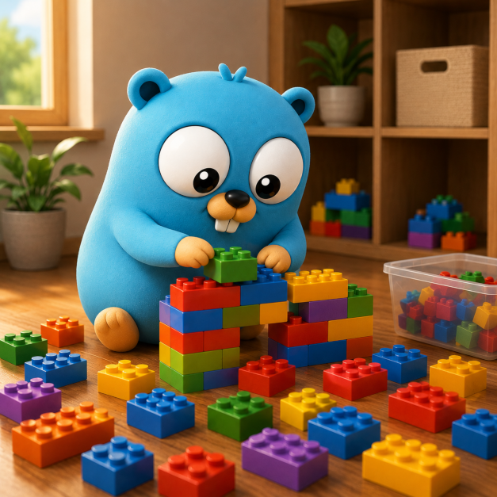

# go-types

[](https://git.windmaker.net/a-castellano/go-types/pipelines)[](https://a-castellano.gitpages.windmaker.net/go-types/coverage.html)[](https://sonarqube.windmaker.net/dashboard?id=a-castellano_go-types_04e236a0-a95a-4aa0-81e1-51718a310623)

<p align="center">
  
</p>

This repo stores types used by many of my projects.

The aim of this repo is to save time and repeated code by unifying them in one single source.

# Available Types

- [rabbitmq](/types/rabbitmq): RabbitMQ config management
- [redis](/types/redis): Redis config management
- [slog](/types/slog): slog logger config management

# Local development

I run every golang task (tests, vet, coverage…) inside a container, **never against a host toolchain**. The same image — `harbor.windmaker.net/limani/base_golang_1_26` — is used in local development, CI and production, so the environment is identical everywhere.

The development container is defined in [development/docker-compose.yml](development/docker-compose.yml). It mounts the repo into `/app` and persists the Go module cache in `development/gomodcache/` (git-ignored) so dependencies are not re-downloaded on every run.

Bring the container up and open a shell in it:

```bash
podman compose -f development/docker-compose.yml up -d
podman compose -f development/docker-compose.yml exec golang /bin/bash
```

Once inside, run any target, e.g.:

```bash
make test
```

Or execute command outside container:

```bash
make test
podman compose -f development/docker-compose.yml exec golang make test
```

Tear it down when finished:

```bash
podman compose -f development/docker-compose.yml down
```
